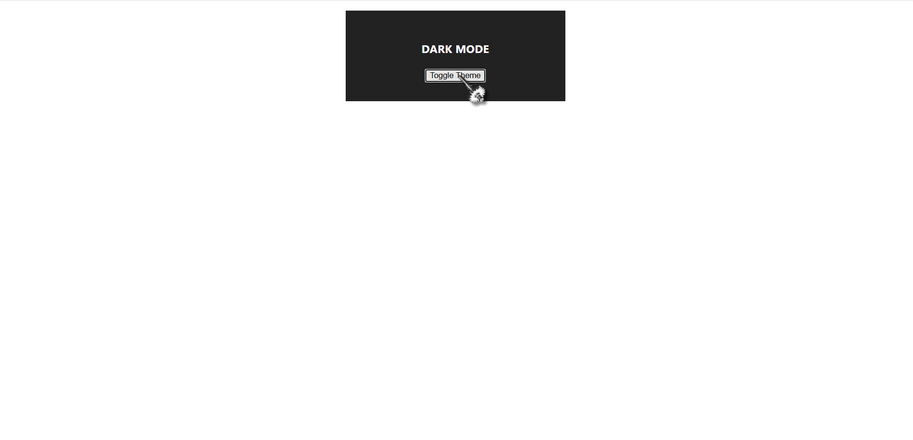

# 🌗 Theme Context Demo

This project is a simple React app that demonstrates how to use the **React Context API** to manage global state — specifically for implementing a light/dark **theme switcher**.

It helps you understand:

- How to avoid **prop drilling**
- How to use `createContext`, `useContext`, and a custom provider
- How to apply context values (theme + toggle) across components

---

## 🚀 Demo

 

---

## 📁 File Structure

theme-context-demo/
├── ThemeContext.js
├── ThemeProvider.js
├── ThemedBox.js
├── App.js
└── ...

🧠 What You'll Learn

    ✅ Creating a context using React.createContext()

    ✅ Using a provider component to pass down values

    ✅ Accessing context with useContext

    ✅ Styling components based on theme

🛠️ Installation

# Clone the repo
git clone https://github.com/luckaty/theme-context-demo.git

# Navigate to the project
cd theme-context-demo

# Install dependencies
npm install

# Start the dev server
npm start

Then visit http://localhost:3000 in your browser.

🔧 How It Works

    ThemeContext.js: Creates a context.

    ThemeProvider.js: Holds the state (light or dark) and provides a toggleTheme function.

    ThemedBox.js: Consumes the context and renders UI with theme styles.

    App.js: Wraps everything inside <ThemeProvider>.

📚 License

This project is open for educational and personal use. Do not use this as a commercial product without permission.
🙌 Author

Built by Blessed Ogechukwu — React learner and web developer on a journey 🚀
💡 Want to Learn More?

    React Context API Docs

    useContext Hook
